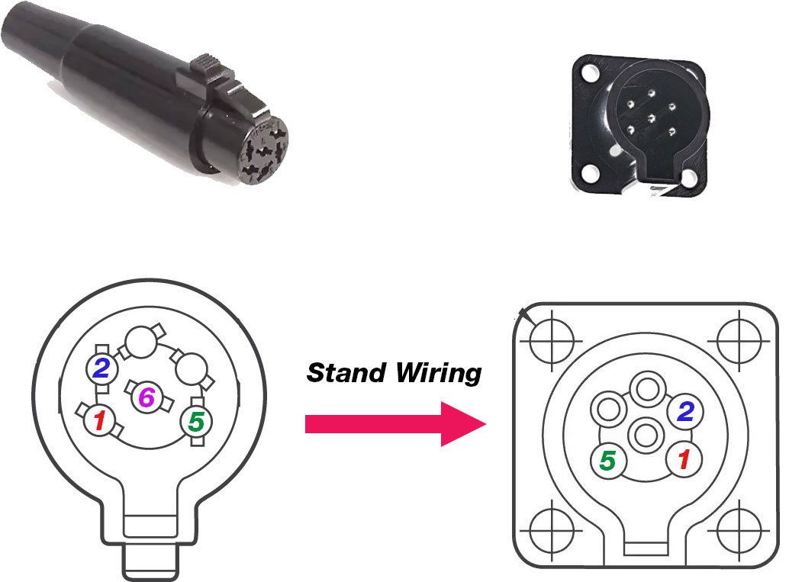
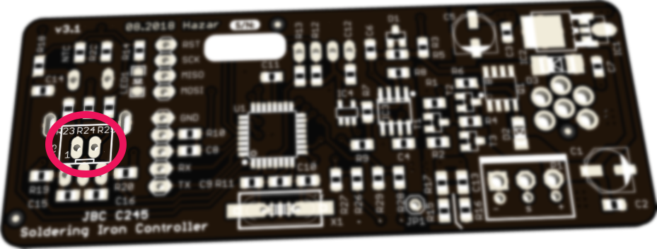

# Stand / Holder Detection Guide for v3.x

v3.x introduces stand/holder detection feature. v3.0 to 3.2 only supports hardware switched (typically a microswitch) stands. Starting from v3.3 both microswitch and electrical detection are supported. 

This document aimed to guide you for using this feature on your v3.x soldering iron controller.

## v3.3x

v3.3 controllers able to detect the tool electrically just like the original unit. In addition to JST-XH header, it is able to use the (normally unused) middle iron connector pin (pin 6) as a detection input. When used with a compatible stand, it supports stand detection out of the box.

**v3.3 JST-XH header location:**

**v3.31 JST-XH header location:**

Available stand detection inputs:

* JST-XH: 
  * Pin 1: Detection input
  * Pin 2: GND
* Front panel iron connector
  * Pin 6 (middle pin): Detection input
  * Pin 1: GND

For stand detection, the controller supports two different approaches each with two options, total of 4:

1. Microswitch detection:
   1. With JST-XH: Works the same as v3.2, for details refer the section below.
   2. With middle iron connector pin: Shorting this pin (iron connector pin 6) to GND provides same result as shorting JST-XH pins together. This is a neater solution compared to drilling the back panel and routing the JST-XH pins to the stand.
2. Electrical detection:
   1. With JST-XH: Detection input (JST-XH pin 1) can detect JBC T245 handle metal ring or C245 cartridge by touching it.
   2. With middle iron connector pin: Detection input (iron connector pin 6) can detect JBC T245 handle metal ring or C245 cartridge by touching it.

With these 4 options you can realize virtually any stand detection scenario. 

#### Here is the recommended & most elegant way possible for bench/lab usage

This setup provides the following connection: Controller > Stand > Handpiece

**You'll need:**

* Clone stand from Asian sellers. An example: https://imgur.com/a/W3IOMTd
* Female iron plug (same as T245 handle): Hirose RPC1-12P-6S

**Directions:**

Clone stand has correct T245 socket for the handle connection but its cable has a different plug. You should replace this with RPC1-12P-6S so you can connect it to the controller. There is no color standard in China so you must determine the connections yourself. Fortunately it's relatively easy.

Here is a quick rundown on what should be done. Remove the connector that attached to stand cable. Connect the new female connector in a way so it connects pin 1 to 1, 2 to 2 and 5 to 5 to the male socket. Connect female pin 6 to stand holder metal pieces for detection and that's it.

Longer description:

Grab a multimeter and remove the screws from stand. You have a male socket on the stand (same on the controller), your goal is connect the female RPC1-12P-6S socket with same pinout so it can connect to controller. In other words, female socket pin 1 should connected to stand male socket pin 1, 2 to 2 and 5 to 5. Skip (do not connect to anything) others for T245. Finally you must have 2 unconnected wires, comes from the stand holder metal piece and tip change metal piece. Connect both of them to female plug pin 6 (middle pin - our stand detection pin). 

Make sure it is correct one more time and plug your T245 handpiece to stand then plug the stand to controller. Select stand detection active low setting from the menu and you're done.

---

## v3.0 to v3.2

These models provides stand detection input via 2-pin JST-XH connector on its PCB. Refer the image below for connector location. It is designated by X3 and located behind the menu knob.

If you short these two pins, say, with a microswitch, the controller detects it and will enter standby mode and lowers the temperature, which is selectable on the menu. The microswitch should mount in a way that closes (or opens) when the iron handle put on the stand.

You may use Hakko holders with simple modification, because they are already have a microswitch. Or you can make your own, here is a some inspiration https://www.instagram.com/p/BsTXX4Ancvv/ .